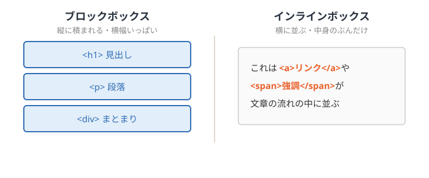
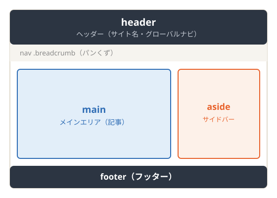
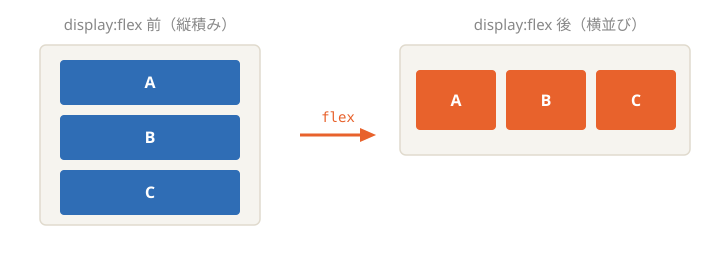
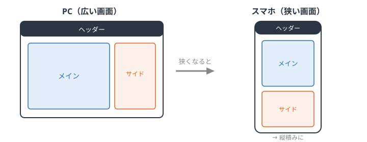

<!-- _class: lead -->
<!-- _paginate: false -->

# Web勉強会（1日目）

## HTML / CSS の基礎

手を動かして自己紹介ページを作る

---

<!-- _class: section-title -->

# 準備

はじめる前に

---

## 準備

### Webページの仕組み

- ブラウザがサーバーにファイルを**リクエスト**する
- サーバーが **HTML / CSS** を返す
- ブラウザがそれを受け取って**画面に表示**する


---

## 準備

### ブラウザについて

- Webページを表示するソフト（Chrome / Safari / Edge など）
- **今回は Chrome を使用します**
  - 開発者ツールが使いやすい
  - シェアが大きく、情報が豊富
  - 拡張機能が充実している

---

## 環境のセットアップ

- **VSCode の拡張機能をインストール**
  - Live Server : 保存すると即座にブラウザへ反映される
  - HTML CSS Support : HTMLとCSSのコード補完
- **Finder の拡張子表示をオンにする**
  - `.html` や `.css` を見分けられるようにするため
  ### Macの場合
  - Finderの設定 → 詳細 →「すべてのファイル名拡張子を表示」
  ### Windowsの場合
  - エクスプローラーの表示 → 表示 → ファイル名拡張子

---

<!-- _class: section-title -->

# HTML

ページの骨組みを作る

---

## マークアップとは

- **マークアップとは**
  - テキストに「これは見出し」「これは段落」と*意味の印*をつけること
- **情報を整理すること**
  - 見た目より先に、内容の構造を考える
  - 「何が見出しで、何が本文で、何が一覧か」

---

## HTMLの書き方

**要素**：開始タグと終了タグでテキストを囲む


- ほとんどのタグは「**開始 → 中身 → 終了**」のペア

---

## HTMLの書き方

- **属性と属性値**：タグに追加情報を渡す
- `属性="属性値"` の形で書く

```html
<a href="https://example.com">リンク</a>

```

- `href` … リンクの飛び先
- `src` … 画像の場所 / `alt` … 画像の説明

---

## HTML

### お決まりセット一覧

```html
<!DOCTYPE html>
<html lang="ja">
  <head>
    <meta charset="UTF-8">
    <title>ページのタイトル</title>
  </head>
  <body>
    <!-- 中身をここに書く -->
  </body>
</html>
```

---
## お決まりセット一覧
- **バージョン指定** … `<!DOCTYPE html>`
- **日本語指定** … `lang="ja"`
- **文字コード** … `<meta charset="UTF-8">`
- **タイトル指定** … `<title>`

---

## HTML

### 親要素・入れ子（ネスト）

- 要素の中に要素を入れられる → **入れ子（ネスト）**
- 外側を**親要素**、内側を**子要素**と呼ぶ

```html
<ul>
  <li>りんご</li>
  <li>みかん</li>
</ul>
```

- `<ul>` が親、`<li>` が子
- 開始と終了の**対応**が崩れないよう注意

---

## HTML

### 見出し ― h1〜h6

- 見出しは **`h1` 〜 `h6`** の6段階
- 数字が小さいほど大きく、**重要な見出し**

```html
<h1>大見出し</h1>
<h2>中見出し</h2>
<h3>小見出し</h3>
```

- 大きさではなく「**意味の階層**」で選ぶ
- `h1` は原則ページに1つ

---

## HTML

### 段落 ― p / br

- **`<p>`** … 段落（意味のひとまとまり）
- **`<br>`** … 改行（ただ行を変えるだけ）

```html
<p>これは段落です。</p>
<p>〒123-4567<br>東京都〇〇区</p>
```

- 余白のために `<br>` を連打しない
- 余白は後で **CSS** で作る

---

## HTML

### 箇条書き ― ul / ol

- **`<ul>`** … 順序なしリスト（黒丸）
- **`<ol>`** … 順序ありリスト（番号）
- 中身はどちらも **`<li>`**

```html
<ul>
  <li>順番が関係ない項目</li>
</ul>
<ol>
  <li>手順1</li>
  <li>手順2</li>
</ol>
```

---

## HTML

### リンク ― a

- **`<a href="">`** … 他のページやサイトへ飛ぶ

```html
<a href="https://github.com">GitHub</a>
```

- `href` に飛び先のURL
- タグの中身が、画面に表示される文字

---

## HTML

### 画像 ― img

- **``** で画像を表示
- 主な画像形式
  - **svg** … 図形・アイコン（拡大しても劣化しない）
  - **jpg** … 写真向き
  - **png** … 透明を扱える

```html

```

---

## HTML

### 読みやすいコード

- **インデント**（字下げ）で入れ子を見やすく

```html
<ul>
  <li>字下げすると構造が分かる</li>
</ul>
```

- **コメントアウト** … メモやメモ書きを残す（画面には出ない）

```html
<!-- ここはコメント。表示されない -->
```

---

<!-- _class: section-title -->

# CSS

ページの見た目を整える

---

## CSS

### 書き方

- 「**どこの** { **何を**:**どうする**; }」の形

```css
p {
  color: red;
}
```

- `p` … セレクタ（どの要素を）
- `color` … プロパティ（何を）
- `red` … 値（どうする）
- 行末の **`;`** を忘れない

---

## CSS

### HTMLと紐付け

- CSSファイルの先頭に文字コード宣言

```css
@charset "utf-8";
```

- HTMLの `<head>` から読み込む

```html
<link rel="stylesheet" href="style.css">
```

---

## CSS

### コメントアウト・デフォルトCSS

- **コメントアウト** … メモを残す（適用されない）

```css
/* ここはコメント */
```

- **デフォルトCSS**
  - ブラウザが最初から持っているスタイル
  - 見出しが大きい、余白がある…などは初期設定
  - これを上書きして自分好みにしていく

---

## CSS

### ボックスモデル

すべての要素は「**箱**」でできている


**content**中身 / **padding**内余白 / **border**枠線 / **margin**外余白

---

## CSS

### ブロック / インライン



- **ブロック**は縦積み・横幅いっぱい / **インライン**は文章の流れの中に並ぶ

---

## CSS

### 背景・色指定

- **背景** … `background-color`

```css
body { background-color: #f7f5ef; }
```

- **色指定** の方法
  - 色名 … `red` `blue`
  - カラーコード … `#e8622c`（#で始まる6文字）

---

## CSS

### フォントの指定

- **フォントの種類** … `font-family`

```css
body { font-family: sans-serif; }
```

- **フォントのサイズ** … `font-size`

```css
h1 { font-size: 32px; }
```

- 太さは `font-weight: bold;`

---

## CSS

### 枠線・余白・中央よせ

```css
.box {
  border: 1px solid #ccc;   /* 枠線 */
  padding: 16px;            /* 内側の余白 */
  margin: 24px;             /* 外側の余白 */
  text-align: center;       /* 中央よせ */
}
```

- **枠線** border / **余白** padding・margin
- **中央よせ** text-align: center

---

## CSS

### ボタンを作る

```css
.button {
  display: inline-block;
  background-color: #e8622c;
  color: white;
  padding: 12px 24px;
  border-radius: 8px;
}
```

- **`display`** … 表示のされ方を変える
- **`border-radius`** … 角を丸める
- **`color`** … 文字の色

**→ ちょっと実戦：自己紹介ページを装飾してみよう**

---

<!-- _class: section-title -->

# ブログサイト

Webサイトの構成を知る

---

## ブログサイト

### 主なパーツ

- **ヘッダー** … ページ上部（タイトル・ロゴ）
- **メインエリア** … 中心の内容
- **フッター** … ページ下部（コピーライトなど）
- サイドの補助要素
  - ナビゲーション / サイドバー

---

## ブログサイト

### ナビゲーションの種類

- **グローバルナビゲーション**
  - サイト全体で共通のメニュー
- **ローカルナビゲーション**
  - あるページ内・カテゴリ内のメニュー
- **パンくずナビゲーション**
  - 「トップ > カテゴリ > 記事」の現在地表示

---

## ブログサイト

### ファイルの構成

```
my-site/
├── index.html      … トップページ
├── about.html      … 別ページ
├── css/
│   └── style.css   … スタイル
└── images/
    └── logo.png    … 画像
```

- HTML・CSS・画像をフォルダで整理する

---

## ブログサイト

### class と id

- **class** … 同じスタイルを**複数**に付けられる

```html
<p class="intro">〜</p>
```

- **id** … ページ内で**1つだけ**の目印

```html
<div id="header">〜</div>
```

---

## ブログサイト

### セレクタの書き方

```css
p          { }   /* タグ名で指定 */
.intro     { }   /* class は . を付ける */
#header    { }   /* id は # を付ける */
ul li      { }   /* ul の中の li */
```

- **class** は `.`、**id** は `#`
- スペースで区切ると「〜の中の〜」

---

<!-- _class: section-title -->

# ブログサイトを作る

学んだ全部を組み合わせる

---

## ブログサイトを作る

### 今日の集大成 ― 完成イメージ

これまで習ったタグ・CSSを組み合わせると、
こんな**ブログサイト**が作れます。

- ヘッダー / メイン / サイドバー / フッター
- 3種類のナビゲーション
- class・id とセレクタの使い分け

**→ 配布した作例ファイルを一緒に見ていきましょう**

---

## ブログサイトを作る

### 全体の構成



- 大きな箱（`<header>` `<div>` `<footer>` など）で区画を分ける

---

## ブログサイトを作る

### HTMLの骨組み

```html
<header id="header">
  <h1>サイト名</h1>
  <nav class="global-nav"> ... </nav>
</header>

<div class="container">
  <main class="main-area"> ... </main>
  <aside class="sidebar"> ... </aside>
</div>

<footer id="footer"> ... </footer>
```

- **id** で大区画（header / footer）、**class** で繰り返すパーツ

---

## ブログサイトを作る

### 横並びは Flexbox で



```css
.container { display: flex; }   /* メインとサイドバーを横に並べる */
```

- `display: flex` で横並び / `flex` の数字で幅の**比率**

---

## ブログサイトを作る

### スマホ対応（レスポンシブ）



```css
@media (max-width: 768px) {
  .container { flex-direction: column; }  /* 横並び→縦積み */
}
```

---

## ブログサイトを作る

### インライン要素の例 ― span

```html
<p>特に <span class="tag-name">&lt;h1&gt;</span> が便利。</p>
```

```css
.tag-name {
  background-color: #f0ece1;
  color: #b5451f;
}
```

- **`<span>`** … 文中の一部だけを囲む（インライン要素）
- 段落 `<p>` のような**ブロック**と違い、文章の流れの中に収まる

---

## ブログサイトを作る

### まとめ ― 今日の全部がここに

| 使った知識 | どこに |
|---|---|
| 見出し・段落・リスト | 記事の中身 |
| リンク・画像 | ナビ・サムネイル |
| class / id | 各パーツの指定 |
| 背景・色・余白・枠線 | 全体の装飾 |
| Flexbox | メイン＋サイドバー |
| span・レスポンシブ | 文中装飾・スマホ対応 |

**→ 自分の自己紹介ページにも取り入れてみよう**

---

<!-- _class: lead -->
<!-- _paginate: false -->

# 1日目 おわり

今日は「見た目」を作りました
次回は **JavaScript** で「動き」をつけます

おつかれさまでした 🎉
