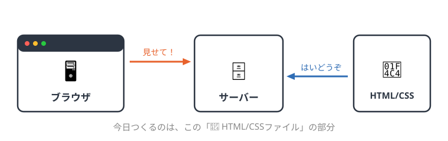
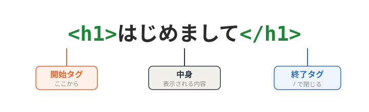
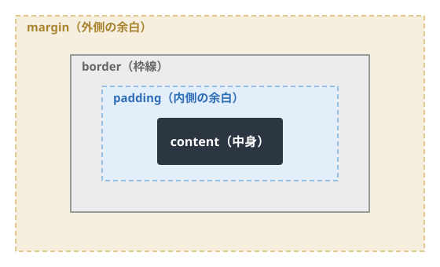

<!-- _class: lead -->
<!-- _paginate: false -->

# Web勉強会（1日目）

## HTML / CSS の基礎
自己紹介ページを作ってみよう

---

<!-- _class: section-title -->

# 準備

はじめる前に

---

## 準備

### Webページの仕組み

- ブラウザがサーバーにファイルを**リクエスト**する
- サーバーが **HTML / CSS** を返す
- ブラウザがそれを受け取って**画面に表示**する



---

## 準備

### ブラウザについて

- Webページを表示するソフト（Chrome / Safari / Edge など）
- **今回は Chrome を使用します**
  - 開発者ツールが使いやすい
  - シェアが大きく、情報が豊富
  - 拡張機能が充実している

---

## 環境のセットアップ

- **VSCode の拡張機能をインストール**
  - Live Server : 保存すると即座にブラウザへ反映される
  - HTML CSS Support : HTMLとCSSのコード補完
- **拡張子表示をオンにする**（`.html` `.css` を見分けるため）
  - **Mac** … Finderの設定 → 詳細 →「すべてのファイル名拡張子を表示」
  - **Windows** … エクスプローラーの表示 → 表示 → ファイル名拡張子

---

## 今日の目標

**`index.html`** と **`style.css`** の2つのファイルで、自分だけの**自己紹介ページ**を作ります。

- 前半：**HTML** でページの中身をすべて書く
- 後半：**CSS** で色や見た目を整える

---

<!-- _class: section-title -->

# HTML

ページの骨組みを作る

---

## マークアップとは

- **マークアップとは**
  - テキストに「これは見出し」「これは段落」と*意味の印*をつけること
- **情報を整理すること**
  - 見た目より先に、内容の構造を考える
  - 「何が見出しで、何が本文で、何が一覧か」

---

## HTMLの書き方 ― 要素

**要素**：開始タグと終了タグでテキストを囲む



- ほとんどのタグは「**開始 → 中身 → 終了**」のペア

---

## HTMLの書き方 ― 属性

- **属性と属性値**：タグに追加情報を渡す
- `属性="属性値"` の形で書く

```html
<a href="https://example.com">リンク</a>

```

- `href` … リンクの飛び先
- `src` … 画像の場所 / `alt` … 画像の説明

---

## HTML ― お決まりセット【説明】

- どのページも、まずこの「型」から始まる
  - **`<!DOCTYPE html>`** … HTMLのバージョン宣言
  - **`lang="ja"`** … 日本語のページだと伝える
  - **`<meta charset="UTF-8">`** … 文字コード（文字化け防止）
  - **`<title>`** … タブに出るページ名
- `<head>`（設定）と `<body>`（中身）に分かれる

---

<!-- _class: code-slide -->

## 【コード①】ファイルの型を書く

<span class="badge">index.html</span>

```html
<!DOCTYPE html>
<html lang="ja">
<head>
  <meta charset="UTF-8">
  <title>わたしの自己紹介</title>
  <link rel="stylesheet" href="style.css">
</head>
<body>

  <!-- ここから中身を書いていく -->

</body>
</html>
```

- `<link>` は後で作る **style.css** を読み込む行

---

## HTML ― 見出し【説明】

### 見出し ― h1〜h6

- 見出しは **`h1` 〜 `h6`** の6段階
- 数字が小さいほど大きく、**重要な見出し**
- 大きさではなく「**意味の階層**」で選ぶ
- `h1` は原則ページに1つ（＝ページの主題）

```html
<h1>大見出し</h1>
<h2>中見出し</h2>
```

---

<!-- _class: code-slide -->

## 【コード②】大見出しを書く

<span class="badge">index.html … body の中</span>

```html
  <!-- 大見出し -->
  <h1>わたしの自己紹介</h1>
```

- ページの主題なので **`<h1>`**
- 中身は自分のページのタイトルにしてOK

---

## HTML ― 画像【説明】

### 画像 ― img

- **``** で画像を表示
- `src` … 画像ファイルの場所 / `alt` … 画像の説明
- 主な形式：**svg**（図形）/ **jpg**（写真）/ **png**（透明）

```html

```

---

<!-- _class: code-slide -->

## 【コード③】プロフィール画像を入れる

<span class="badge">index.html … h1 の下</span>

```html
  <!-- プロフィール画像 -->
  
```

- 画像が無くても `alt` の文字が出るのでOK
- 用意できる人は `me.jpg` を同じフォルダに置く

---

## HTML ― 段落と強調【説明】

### 段落 ― p / br / strong

- **`<p>`** … 段落（意味のひとまとまり）
- **`<br>`** … 改行（ただ行を変えるだけ）
- **`<strong>`** … 重要な部分を強調（太字になる）

```html
<p>これは段落です。</p>
<p>〒123-4567<br>東京都〇〇区</p>
```

---

<!-- _class: code-slide -->

## 【コード④】自己紹介の文章を書く

<span class="badge">index.html … img の下</span>

```html
  <!-- 自己紹介の文章 -->
  <h2>はじめまして</h2>
  <p>プログラミングを勉強中の大学1年生です。<strong>Web制作</strong>に興味があります。</p>
  <p>〒123-4567<br>〇〇県〇〇市</p>
```

- 見出しは `<h2>`、本文は `<p>`
- 強調したい所を `<strong>` で囲む

---

## HTML ― リスト【説明】

### 箇条書き ― ul / ol

- **`<ul>`** … 順序なしリスト（黒丸）
- **`<ol>`** … 順序ありリスト（番号）
- 中身はどちらも **`<li>`**

```html
<ul>
  <li>順番が関係ない項目</li>
</ul>
```

- ネスト（入れ子）：`<ul>` の中に `<li>` を入れる

---

<!-- _class: code-slide -->

## 【コード⑤】好きなものリスト（ul）

<span class="badge">index.html … 文章の下</span>

```html
  <!-- 好きなもの（順序なしリスト） -->
  <h2>好きなもの</h2>
  <ul>
    <li>ラーメン</li>
    <li>ゲーム</li>
    <li>音楽</li>
  </ul>
```

- 順番は関係ないので **`<ul>`**（黒丸）

---

<!-- _class: code-slide -->

## 【コード⑥】やりたいことリスト（ol）

<span class="badge">index.html … 好きなものの下</span>

```html
  <!-- これからやりたいこと（順序ありリスト） -->
  <h2>これからやりたいこと</h2>
  <ol>
    <li>Webサイトを作る</li>
    <li>JavaScriptを学ぶ</li>
    <li>自分のサイトを公開する</li>
  </ol>
```

- 順番に意味があるので **`<ol>`**（番号）

---

## HTML ― リンク【説明】

### リンク ― a

- **`<a href="">`** … 他のページやサイトへ飛ぶ
- `href` に飛び先のURL、中身が画面に出る文字

```html
<a href="https://github.com">GitHub</a>
```

---

<!-- _class: code-slide -->

## 【コード⑦】リンクを並べる

<span class="badge">index.html … リストの下</span>

```html
  <!-- リンク -->
  <h2>リンク</h2>
  <ul>
    <li><a href="https://github.com">GitHub</a></li>
    <li><a href="https://example.com">ポートフォリオ</a></li>
  </ul>
```

- リンクをリストに入れて並べている（入れ子）

---

<!-- _class: code-slide -->

## 【コード⑧】仕上げの段落

<span class="badge">index.html … リンクの下</span>

```html
  <!-- ボタン（CSSで装飾する） -->
  <a href="https://example.com" class="button">お問い合わせはこちら</a>

  <!-- 仕上げの段落 -->
  <p class="intro">読んでくれてありがとう！</p>
```

- `class="button"` `class="intro"` は**後半のCSSで使う名前**
- 今は見た目が地味でもOK

---

## HTML完成 ― 読みやすく書くコツ

- **インデント**（字下げ）で入れ子を見やすく
- **コメント** `<!-- -->` でメモを残す（画面には出ない）

<span class="badge">ここまでで index.html が完成</span>

- 保存してブラウザで開くと、**まだ地味な**自己紹介ページが表示される
- 次は **CSS** で見た目を整えます

---

<!-- _class: section-title -->

# CSS

ページの見た目を整える

---

## CSSの書き方【説明】

- 「**どこの** { **何を**:**どうする**; }」の形

```css
p {
  color: red;
}
```

- `p` … セレクタ（どの要素を）
- `color` … プロパティ（何を）／ `red` … 値（どうする）
- 行末の **`;`**、記号は**半角**

---

## CSS ― HTMLとの紐付け【説明】

- CSSファイルの先頭に文字コード宣言
- HTML側は `<link>` で読み込む（コード①で記入済み）

```css
@charset "utf-8";
```

```html
<link rel="stylesheet" href="style.css">
```

- コメントは `/* ここはメモ */`

---

<!-- _class: code-slide -->

## 【コード⑨】style.css を作り始める

<span class="badge">style.css</span>

```css
@charset "utf-8";

/* ページ全体の設定 */
body {
  font-family: "Hiragino Kaku Gothic ProN", "Yu Gothic", sans-serif;
  color: #333333;              /* 文字の色 */
  background-color: #f7f5ef;   /* 背景の色 */
  text-align: center;          /* 中央よせ */
  margin: 40px;                /* 外側の余白 */
  line-height: 1.8;
}
```

- 保存すると、背景がクリーム色＆中央寄せに変わる

---

## CSS ― 色・フォント・余白【説明】

- **色** … `color`（文字）/ `background-color`（背景）
  - カラーコード `#e8622c`（#で始まる6文字）
- **フォント** … `font-family`（種類）/ `font-size`（大きさ）
- **余白** … `padding`（内）/ `margin`（外）
- **中央よせ** … `text-align: center`

---

## CSS ― 見出しの装飾【説明】

- タグ名で狙うと、そのタグ全部に効く
- 枠線 `border-bottom` で下線を引ける
- `width` ＋ `margin: auto` で幅を決めて中央に

```css
h1 { color: #e8622c; }
```

---

<!-- _class: code-slide -->

## 【コード⑩】大見出し(h1)に色をつける

<span class="badge">style.css … body の下</span>

```css
/* 大見出し */
h1 {
  color: #e8622c;              /* 見出しの色 */
  font-size: 32px;             /* 文字の大きさ */
}
```

- タグ名 `h1` で狙うと、見出し全部に効く

---

<!-- _class: code-slide -->

## 【コード⑪】中見出し(h2)を線で飾る

<span class="badge">style.css … h1 の下</span>

```css
/* 中見出し */
h2 {
  color: #2c3542;
  font-size: 22px;
  border-bottom: 2px solid #e8622c;  /* 下線 */
  padding-bottom: 8px;
  width: 260px;
  margin: 0 auto;                    /* 中央よせ */
}
```

- `border-bottom` で下線、`margin: 0 auto` で中央に

---

## CSS ― ボックスモデル【説明】

すべての要素は「**箱**」でできている



**content**中身 / **padding**内余白 / **border**枠線 / **margin**外余白

---

<!-- _class: code-slide -->

## 【コード⑫】画像を丸く・リストを整える

<span class="badge">style.css … 見出しの下</span>

```css
/* 画像を丸くする */
img {
  width: 200px;
  border-radius: 50%;          /* 角を丸く → 真円 */
}

/* リスト */
ul, ol {
  list-style-position: inside;
  padding-left: 0;
}
```

- `border-radius: 50%` で真円になる

---

## CSS ― class で狙い撃ち【説明】

### class と id

- **class** … 同じスタイルを**複数**に付けられる（`.` で狙う）
- **id** … ページ内で**1つだけ**の目印（`#` で狙う）

```css
.intro { color: blue; }   /* class は . */
#title { color: red; }    /* id は # */
```

- HTMLで付けた `class="intro"` を、CSSは `.intro` で狙う

---

<!-- _class: code-slide -->

## 【コード⑬】リンクと仕上げの段落

<span class="badge">style.css … 画像の下</span>

```css
/* リンクの色 */
a {
  color: #2f6db5;
}

/* class="intro" の段落だけ */
.intro {
  color: #2f6db5;
  font-weight: bold;           /* 太字 */
  margin-top: 30px;
}
```

- `a` は全リンク、`.intro` は intro を付けた段落だけ

---

## CSS ― ボタンを作る【説明】

- いくつかのプロパティを組み合わせると「ボタン」になる
  - **`display: inline-block`** … 幅や余白を持てるように
  - **`background-color`** … 背景の色
  - **`padding`** … 内側の余白（大きさ）
  - **`border-radius`** … 角を丸める

---

<!-- _class: code-slide -->

## 【コード⑭】ボタンを仕上げる

<span class="badge">style.css … 最後に追加</span>

```css
/* ボタン（class="button"） */
.button {
  display: inline-block;       /* 幅・余白を持てる */
  background-color: #e8622c;   /* 背景の色 */
  color: #ffffff;              /* 文字の色 */
  padding: 12px 28px;          /* 内側の余白 */
  border-radius: 8px;          /* 角を丸く */
  text-decoration: none;       /* 下線を消す */
  margin-top: 20px;
}
```

<span class="badge">これで style.css も完成！</span>

---

## 完成イメージ

- HTMLで骨組み、CSSで見た目 → **自己紹介ページが完成**
- 色・文字・中身は自分好みに変えてOK

<span class="badge">お手本と見比べてみよう</span>

- できた人は、背景色や見出しの色を変えてカスタマイズ
- リストを増やしたり、文章を自分の内容に書き換えたり

---

<!-- _class: lead -->
<!-- _paginate: false -->

# 1日目 おわり

今日は HTML と CSS で「見た目」を作りました
次回は **ブログサイト** と **JavaScript** に挑戦します

おつかれさまでした